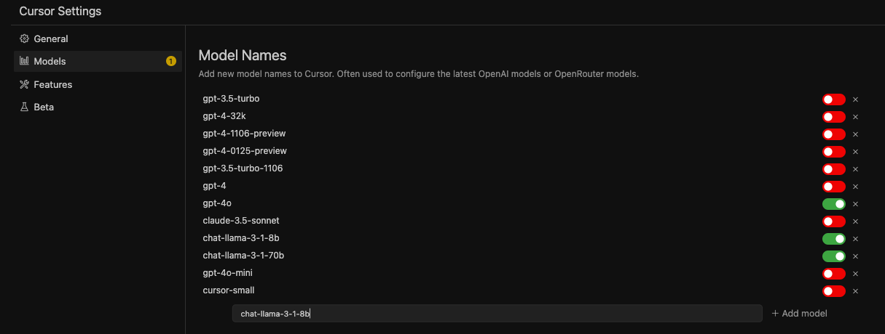

# Guide to use SN19 with Cursor

### **Open settings**
Follow these steps on a mac:

If you're on ubuntu or windows, please visit https://www.apple.com/shop/buy-mac for further instructions

### **Add a new model, named exactly `chat-llama-3-1-8b`**

It's very important the name matches exactly

### **Configure custom 'OPENAI' endpoint**

First, disable all other OpenAI models. Don't worry, they're degraded to hell anyway

Use:

Endpoint: `https://testnet.sn19.ai/v1` - NOTE: when Nineteen 5.0 is live, you can use *ANY* validator on subnet 19

Key: 3a1d9d2c-79d2-4408-bvfb-ab0036c01293

# Done
Enjoy :)